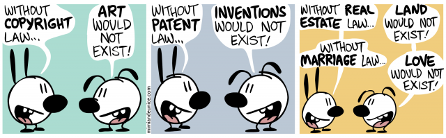

# Source Code Analytics With Roslyn and JavaScript Data Visualization

Reworked examples from the book [Source Code Analytics With Roslyn and JavaScript Data Visualization](http://www.apress.com/us/book/9781484219249).

## About

The book [Source Code Analytics With Roslyn and JavaScript Data Visualization](http://www.apress.com/us/book/9781484219249) contains examples of potentially useful Roslyn's Syntax API usage. I thought it would be good to solve them on my own in order to get hands-on experience with the Syntax API.

Of course, as always when I code for learning purposes, I wrote all the code [without guns](https://github.com/ironcev/without-guns-for-vs-code).

It turned out that some of my solutions are simpler then those presented in the book and, in my humble opinion, easier to understand. Reworked solutions cover as well not only the "happy path" but also explore "edge cases" that can be expected in reality.

## Finding the Reworked Examples

If you own the book, finding the corresponding reworked example is straightforward. Each reworked example is a single LINQ file. The name of the LINQ file is same as the listing of the corresponding example in the book. For example, the file *2-1 Finding Magic Number Usages in Mathematical Expressions.linq* corresponds to the *Listing 2-1. Finding Magic Number Usages in Mathematical Expressions* in the book.

## Running the Reworked Examples

To run the examples you will need [LINQPad](http://www.linqpad.net) version greater then or equal to 5.22.03. You can download LINQPad from its [download page](http://www.linqpad.net/Download.aspx). For your convenience, the version 5.26.01 of LINQPad is included in the [tools](tools) folder of this repository.

Once you have LINQPad running, simple open the LINQ files in LINQPad and execute them.

## License

The reworked examples are neither licensed nor copyrighted. You can do whatever you want with them as long as you don't say you created them yourself ;-) In case of (re)use, providing a link to this GitHub repository would be highly appreciated, but it's not mandatory.

    

